# Web-based-3D-visualization-of-oceanic-forecasting-data

This is the code for the web-based 3D visualization of ocean simulation outputs.Cesium virtual globe, Plotly, heatmap, and moving-particle technologies were adopted in the development of Web-based-3D-visualization-of-oceanic-forecasting-data providing users with an interactive 3DGIS experience on a virtual globe while at the same time offering efficient volume rendering and enriched interactive volume analysis.

The demo of this system is shown as follows:

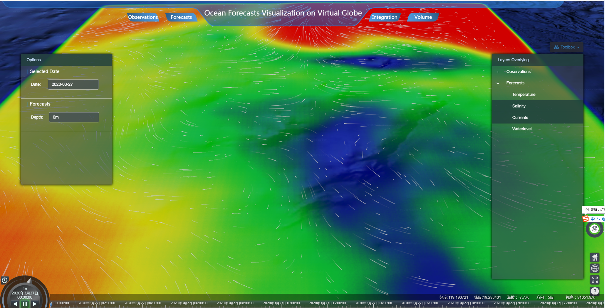

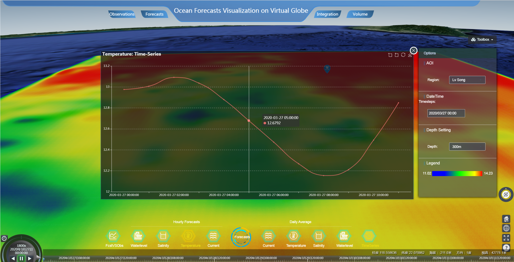

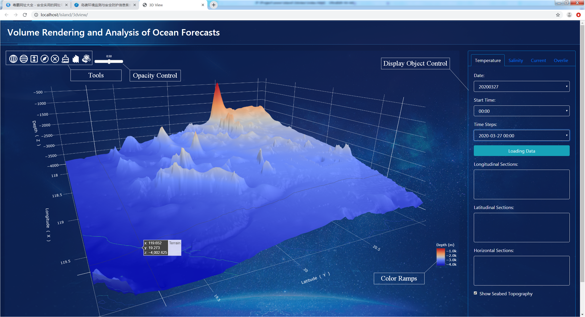

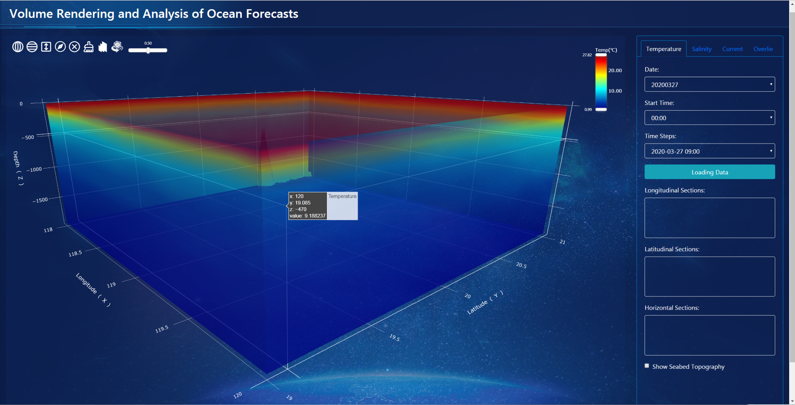

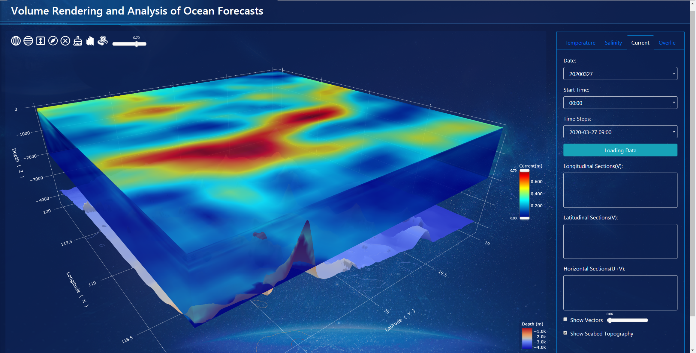

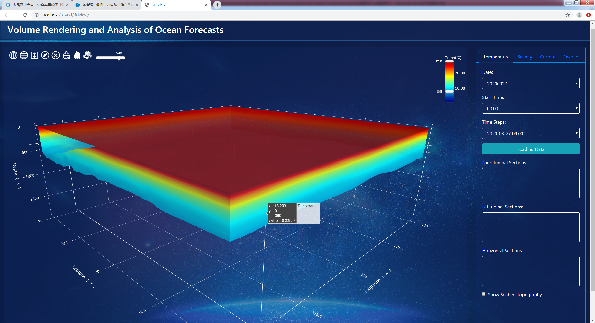

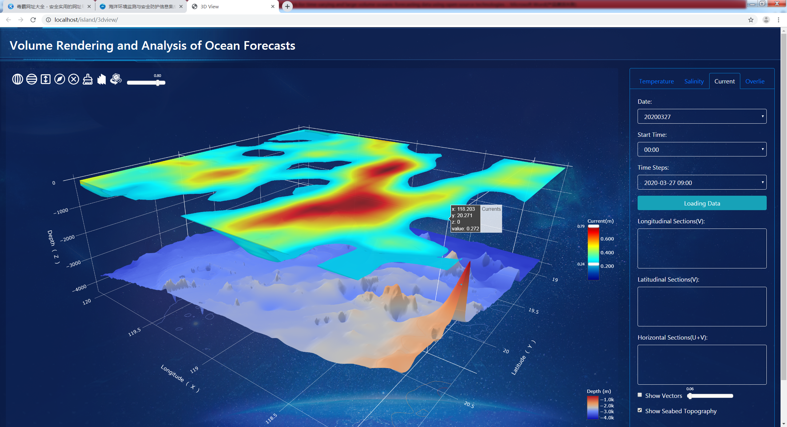

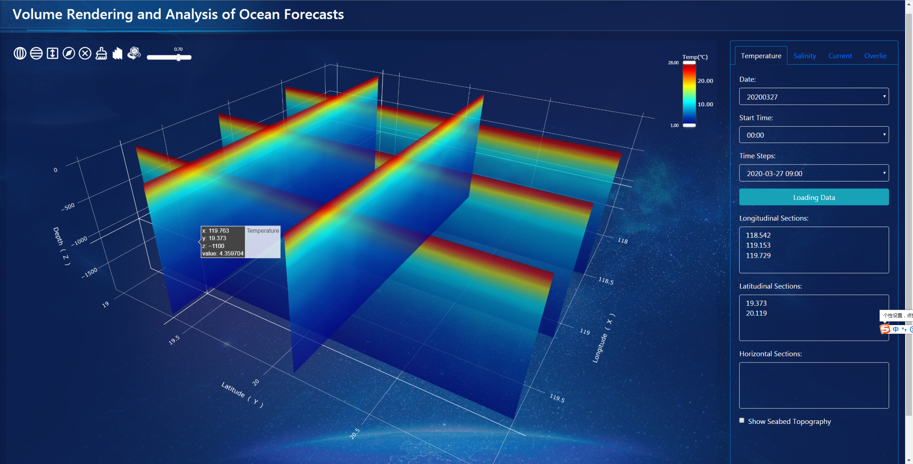

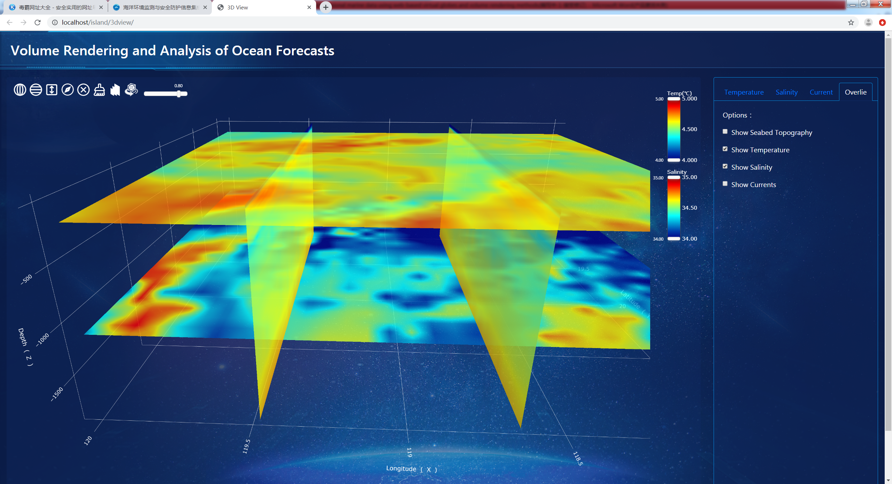

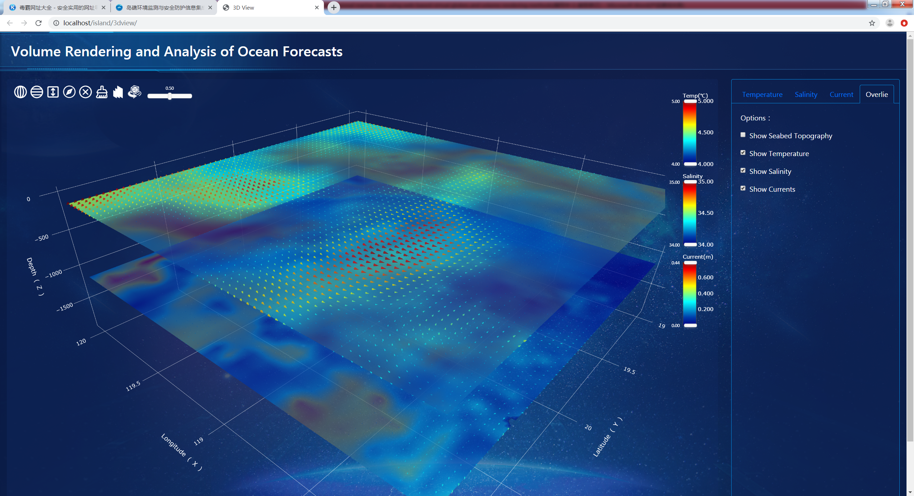

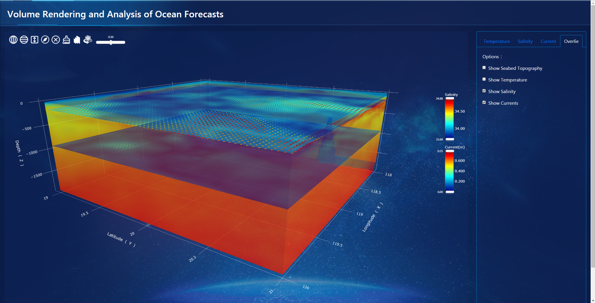